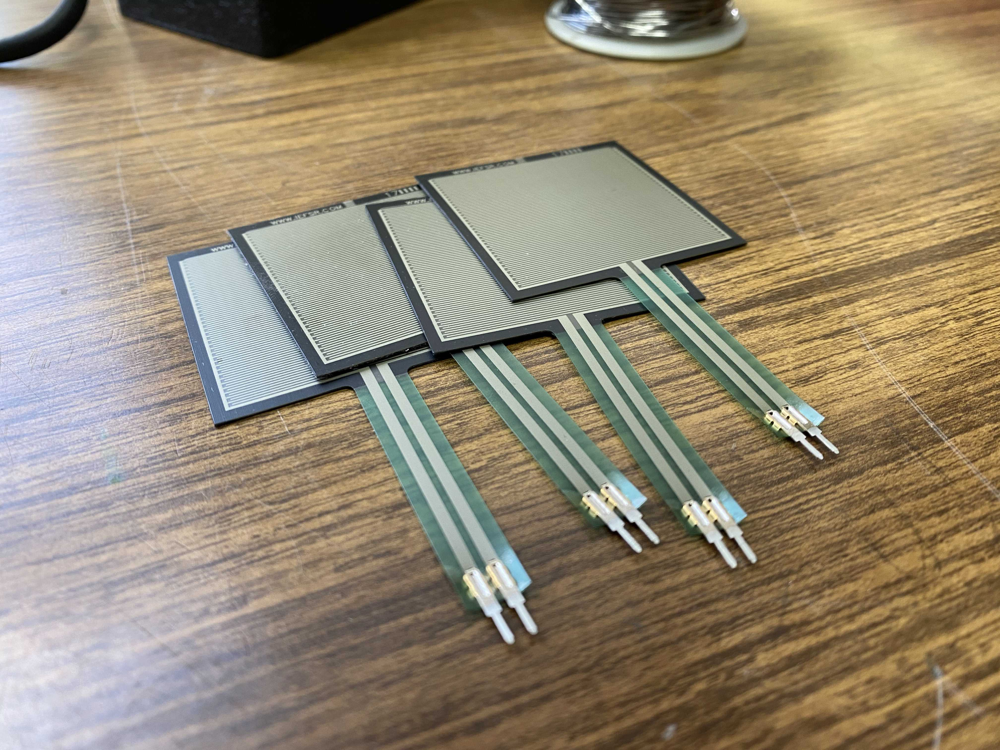
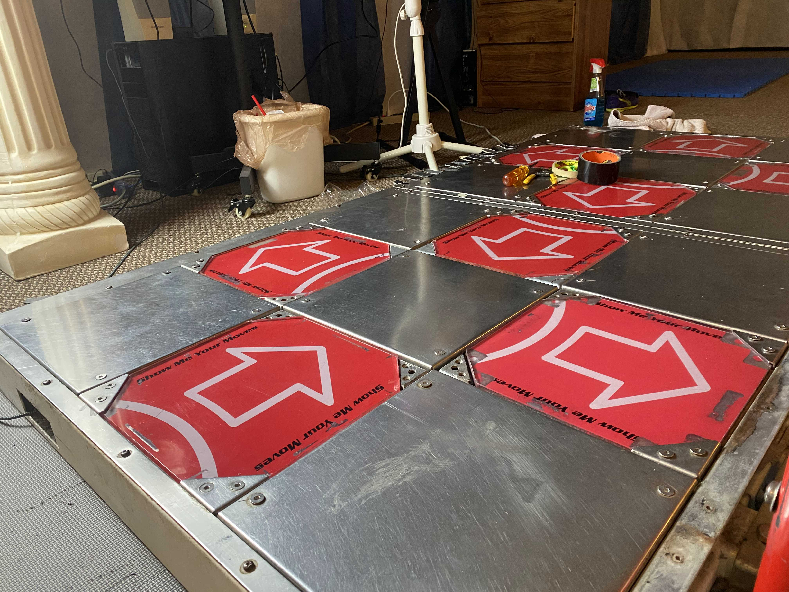
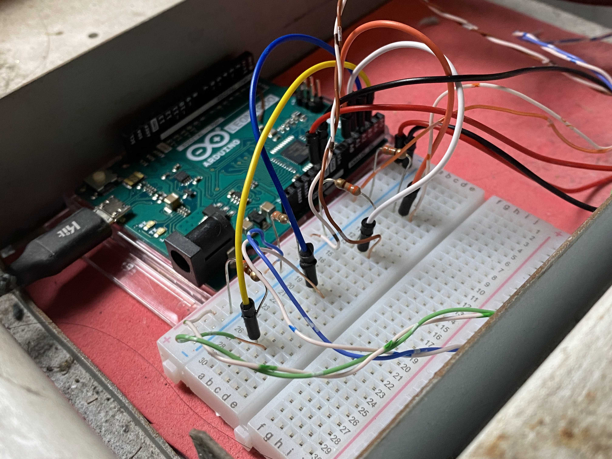
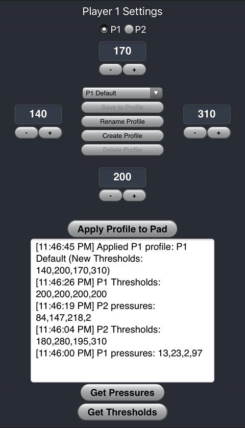

# Force Sensitive Resistors for 4-Panel Dance Game Pads
## Table of Contents
- [Force Sensitive Resistors for 4-Panel Dance Game Pads](#force-sensitive-resistors-for-4-panel-dance-game-pads)
  - [Table of Contents](#table-of-contents)
  - [Introduction](#introduction)
    - [Why use FSRs?](#why-use-fsrs)
    - [High-level Design](#high-level-design)
  - [Installation](#installation)
  - [Credits](#credits)

## Introduction
A Force Sensitive Resistor (FSR) is a resistor that changes its resistive value depending on how much pressure is applied to its surface. They can be used to handle controller inputs on a dance game controller such as one for Dance Dance Revolution (DDR), In The Groove (ITG), or Stepmania.

    
    
    

### Why use FSRs?
- **Adjustable Sensitivities**
  - Unlike contact sensors which are only ON or OFF, we can determine whether a panel is activated by defining a variable actuation threshold on each individual sensor.
- **User Profiles**
  - Save thresholds to a personal user profile that can be loaded and applied on the fly.
  - Accommodate a wider range of foot sizes, shapes, body weights, and play styles.
- **Remote Pad Maintenance**
  - Set the sensor thresholds through a web app that can be loaded on your phone.
  - There's basically no need to open up the pad and work underneath the panels anymore.
- **Reliability, Consistency**
  - Traditional contact sensors wear down and can be different in quality between manufacturers or even within batches.
  - FSRs can combat consistency over time since players can adjust their sensor thresholds as the sensors get continued use.

### High-level Design
- **Hardware (Arduino Leonardo)**
  - FSRs are connected to a controller with a joystick library to send inputs to the game. 

  - Strings can be written to the controller's serial stream as commands to set new sensitivity thresholds, request the current actuation thresholds, or to request the current amount of pressure applied to the sensors.
  - Any data requests are written back by the serial stream and can be read as bytes.
- **Server (flask)**
  - Use Python to interact with the controller to read/write from the controller's serial stream.
  - Run a sqlite database to persist per-pad sensitivities and user profiles.
  - Standup API endpoints to interact with the database and the controller.
- **Client (Typescript React)**
  - A simple web application gives users an interface for adjusting the controller sensitivity and for loading or saving sensor thresholds on personal profiles.

## Installation
Setting up FSRs for gameplay with an app to adjust the sensitivities happens in three parts.
1. [Setup the hardware.](https://github.com/vlnguyen/itg-fsr/tree/master/fsr) Connect FSRs into an Arduino and flash it with code that will handle joystick inputs.
2. [Stand up the server.](https://github.com/vlnguyen/itg-fsr/tree/master/server) Create API endpoints for interacting with the Arduino and with a local profile database.
3. [Run the web client.](https://github.com/vlnguyen/itg-fsr/tree/master/client) Once the client is running, the web app can be accessed by any device with a browser (phone, tablet, computer) to manage user profiles and sensor thresholds for up to two pads.

## Credits
- Thank you [teejusb](https://github.com/teejusb)! He contributed what I used as a base for the hardware code. It was super easy understand and extend for my own use. ([teejusb/fsr](https://github.com/teejusb/fsr))
  