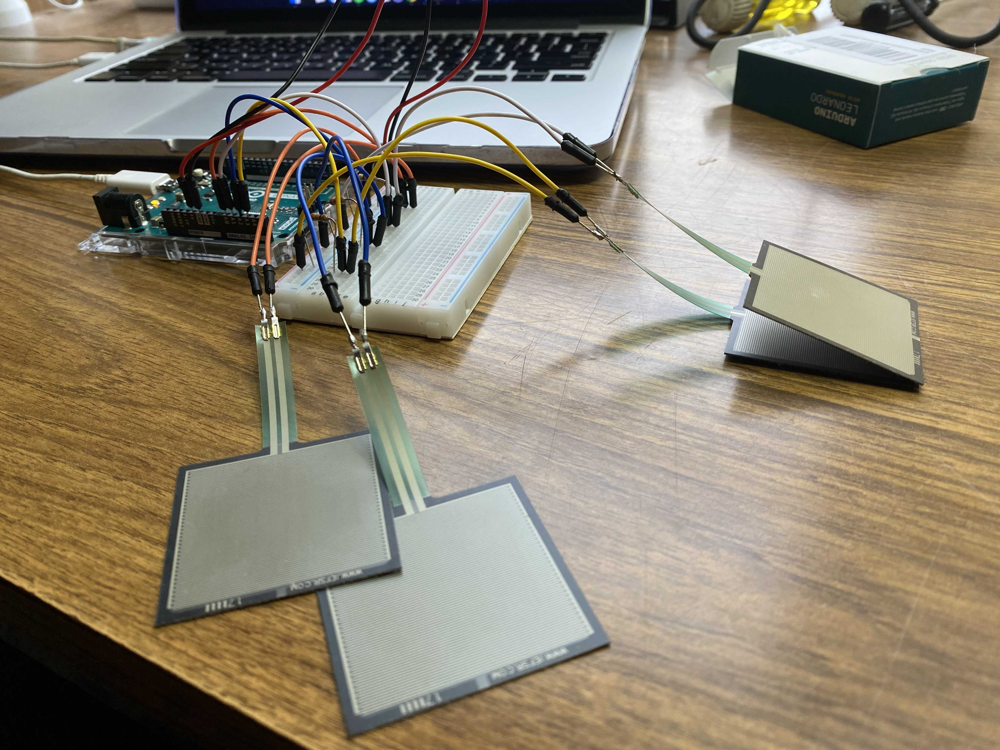
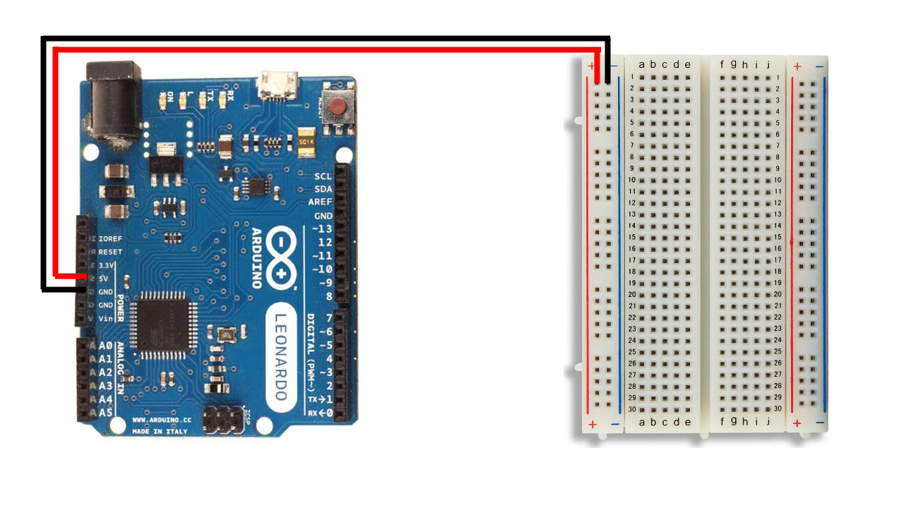
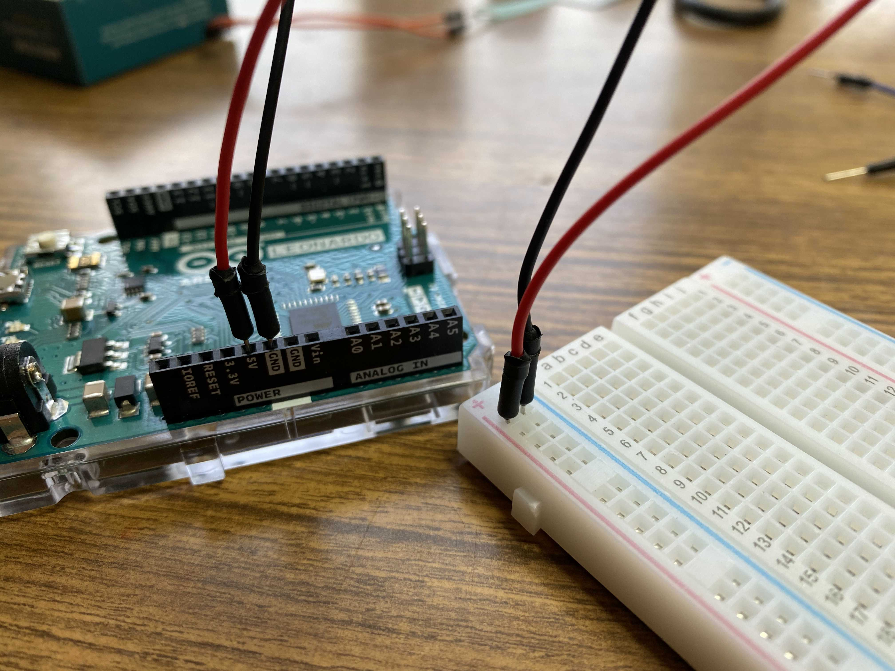
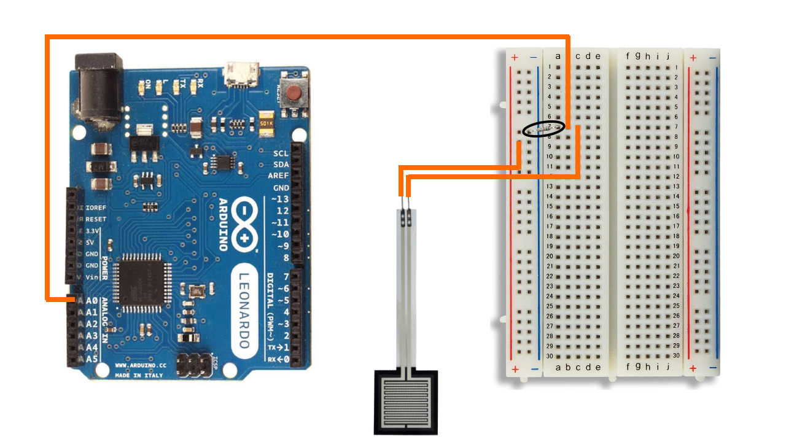
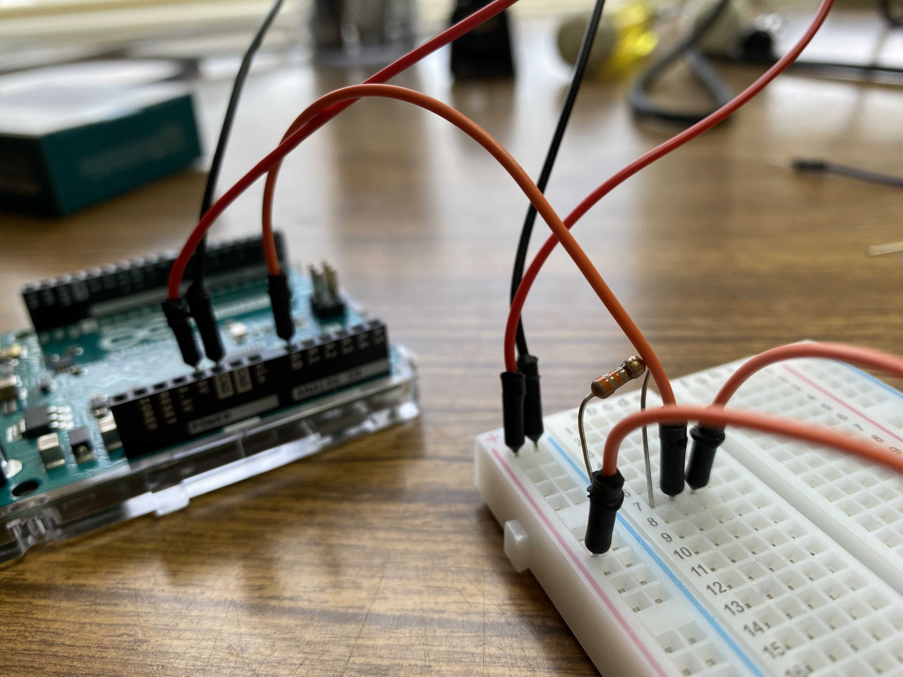
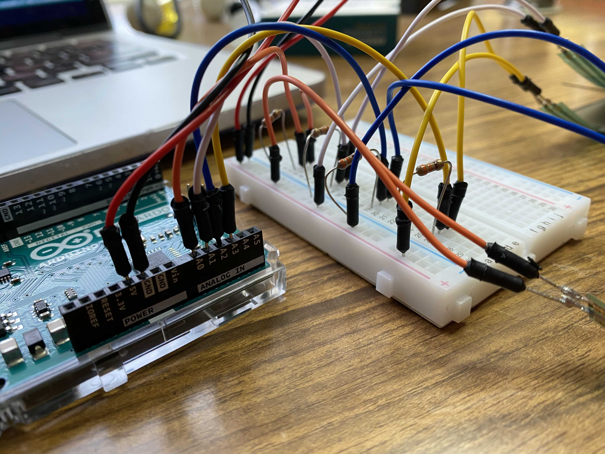
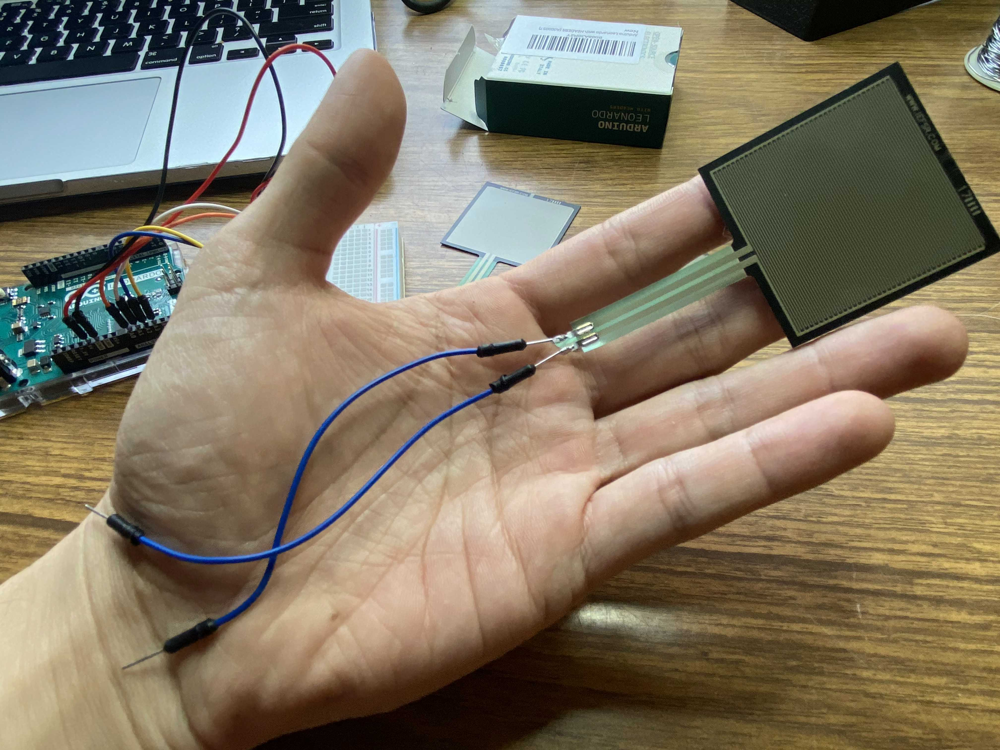
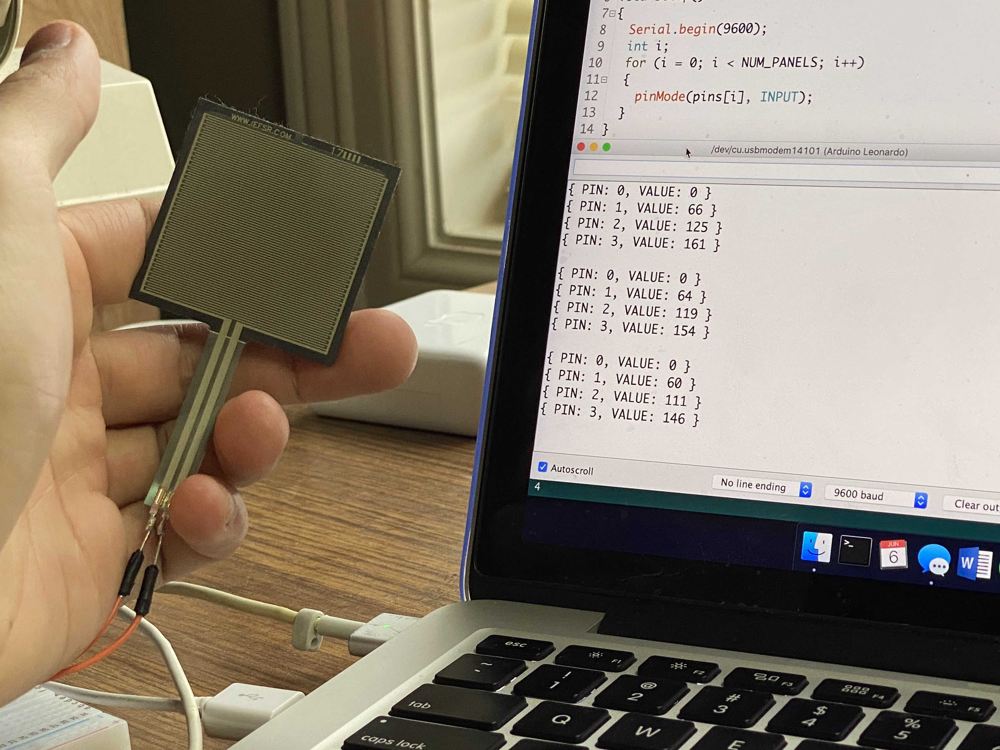
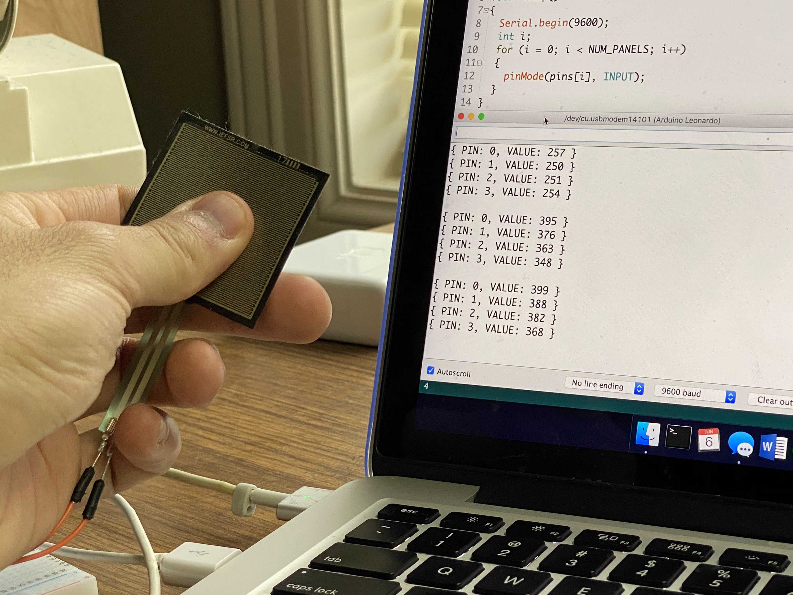

  
# Force Sensitive Resistors w/ Arduino Leonardo
## Table of Contents
- [Force Sensitive Resistors w/ Arduino Leonardo](#force-sensitive-resistors-w-arduino-leonardo)
  - [Table of Contents](#table-of-contents)
  - [Introduction](#introduction)
  - [Note](#note)
    - [This is not an ideal implementation.](#this-is-not-an-ideal-implementation)
    - [This is more sharing my experience than a step-by-step guide.](#this-is-more-sharing-my-experience-than-a-step-by-step-guide)
  - [Requirements](#requirements)
  - [Installation](#installation)
    - [Prototyping](#prototyping)
      - [Setting Up the Hardware](#setting-up-the-hardware)
        - [Alternative to Soldering](#alternative-to-soldering)
      - [Test the Prototype](#test-the-prototype)
    - [TODO](#todo)
  
## Introduction
Force Sensitive Resistors (FSRs) are a great replacement sensor for dance game controllers such as ones used for Dance Dance Revolution (DDR), In The Groove (ITG), or Stepmania. The sensitivities of the sensors can be set to accommodate a wide array of foot sizes and body weights.

In order for FSRs to be used to control game inputs they must first be wired into a controller such as a Teensy or an Arduino Leonardo. The controller must then be flashed with code to handle logic to send joystick inputs as well as accept commands to change the sensor thresholds. 

## Note
### This is not an ideal implementation.
When working on this project I followed a principle I learned from two very different people, a former percussion instructor, Chris, and an acquaintance in the dance game community, Roger.
> If you're doing something you really need to just do it. Don't spend too much time in the details of how you're going to get there, just make sure you put something out there.

I'm really not a hardware engineer by any means, and the installation guide I'm publishing here is far from ideal. I used whatever I had available and did my best to make everything work. It's not the prettest, but I got there. I suggest you do the same thing! 

If you're reading this and you're someone more experienced than I am, take what I have as a template and make it better! In particular, I wish I had more knowledge on PCBs and connectors to make this installation cleaner. 

### This is more sharing my experience than a step-by-step guide.
I prefer prototyping on a smaller scale just to make sure I understand the setup; it makes moving the rig into the pad much easier if I've already verified it works outside of the pad.

If you're looking at this guide just for the circuit schema and the code to flash, by all means you can skip the prototyping and go right to the pad. This is more documenting how I personally went through getting it to work and sharing it, rather than being something that is followed by the letter.

## Requirements
- 1x [Arduino Leonardo](https://www.amazon.com/gp/product/B008A36R2Y/ref=ppx_yo_dt_b_asin_title_o02_s00?ie=UTF8&psc=1)
  - A computer with the [Ardino IDE](https://www.arduino.cc/en/main/software) installed.
- [Breadboard Solderless Prototype PCB Board](https://www.amazon.com/gp/product/B077DN2PS1/ref=ppx_yo_dt_b_asin_title_o01_s00?ie=UTF8&psc=1)
- [Square Force-Sensitive Resistor (FSR) - Interlink 406](https://www.adafruit.com/product/1075)
  - One per panel, doesn't hurt to order backups or more for another pad.
- [330 Ohm Resistors](https://www.amazon.com/gp/product/B0185FGN98/ref=ppx_yo_dt_b_asin_title_o02_s00?ie=UTF8&psc=1)
- [Breadboard Jumper Wires M/M](https://www.amazon.com/gp/product/B005TZJ0AM/ref=ppx_yo_dt_b_asin_title_o01_s00?ie=UTF8&psc=1)
- [Micro USB Cable](https://www.amazon.com/10ft3Pack-Charging-Smartphone-Connection-Blackwhite/dp/B06XYH75NQ/ref=sr_1_3?dchild=1&keywords=10+ft+micro+usb&qid=1591936471&s=electronics&sr=1-3)
  - A shorter one is okay for prototyping.
  - You'll probably want a longer one, 10 feet/3 meters, to comfortably connect your pad to your game PC with however far it is away from the screen.
- DDR/ITG Arcade Pads
  - It's possible to install FSRs into a home pad such as a Cobalt Flux or an L-Tek. Most of this guide will still be useful, but seating the sensor beneath the panel will not be. Get creative!
- Long copper wire and wire strippers, preferably colored.
  - I wish I had gotten these [22 awg colored wire spools](https://www.amazon.com/dp/B07TX6BX47/?coliid=I32F2BXEYC4YR2&colid=2R8F8HC77O2OD&psc=1&ref_=lv_ov_lig_dp_it). Spin out as much as you need and cut it.
  - What I did was take an existing cable, cut off the casing, and used the smaller copper wires inside.
- **OPTIONAL:** Soldering iron and wire
  - You can get away with a dirty implementation that involves alligator clips an the jumper wires. I'll cover this later, but I personally don't recommend it. Soldering is more solid.

## Installation
### Prototyping
#### Setting Up the Hardware
Right now we will need the Arduino Leonardo, a Breadboard Solderless Prototype PCB Board, and some Breadboard Jumper Wires M/M.

Start by using the jumper wires to connect the Arudino 5V and GND pins to the breadboard.

    
    

From here we can connect one FSR by adding a resistor, connecting the FSR to the breadboard, plugging in a jumper wire to read the signal into analog pin A0.

    
    

We can repeat this process three more times with the other FSRs, plugging into analog pins A1, A2, and A3.

##### Alternative to Soldering
Just for prototyping I have a jumper wire soldered onto each side of the FSR, and then opposite end of the jumper wire plugs right into the breadboard.

An exmaple solderless approach is to snap an alligator clip onto each side of the FSR. On the opposite end of the alligator clip you could clip onto a jumper wire, and then plug the jumper wires into the breadboard, essentially creating long cables out of multiple things.

This kind of approach is fine, especially for prototyping. You could run with this implementation when rigging into the pads, but I don't trust alligator clips to stay snapped to the FSR with aggressive steps and pad movement.

I recommend soldering, as long as you're fast about it; the plastic on the FSR could melt if you're too slow. If you don't have a soldering iron or are not willing to learn, this is one of those moments where you'll have to get crafty.

#### Test the Prototype
We can take our Micro USB cable now to connect the Arduino to our PC. Install and run the Arduino IDE.

Go to `Tools` and set the board to `Board: "Arduino Leonardo"`. Set the `Port` to whichever port the Arduino is on.

We can load [fsr_test.ino](https://github.com/vlnguyen/itg-fsr/tree/master/fsr_test) onto the Arduino IDE. Upload the code to the Arduino. Once that succeeds, go to `Tools` and open the `Serial Monitor`.

At this point the serial monitor should be outputting a list of pins and their detected pressure values. If we're not touching any FSRs, all pins should read a value of `0`. 

     
    <i>PIN 0 shows a value of 0.</i>

If we squeeze or press each of the FSRs then we should see that value go up. If all of the FSRs successfully increase value when pressure is applied, then we've validated that our prototype works.

     
    <i>PIN 0 increased its value when pressed.</i>

### TODO
I will explain how I took the prototype and moved it into the pad, as well as instructions on how I handled pad modding to get the panel heights raised for comfort.