# Force Sensitive Resistors w/ Arduino Leonardo
## Table of Contents
- [Force Sensitive Resistors w/ Arduino Leonardo](#force-sensitive-resistors-w-arduino-leonardo)
  - [Table of Contents](#table-of-contents)
  - [Introduction](#introduction)
  - [Personal Note](#personal-note)
  - [Requirements](#requirements)
  - [Installation](#installation)
    - [Prototyping](#prototyping)
      - [Setting Up the Hardware](#setting-up-the-hardware)
        - [Alternative to Soldering](#alternative-to-soldering)
      - [Test the Prototype](#test-the-prototype)
    - [Moving to the Pad](#moving-to-the-pad)
      - [Dropping in the Controller](#dropping-in-the-controller)
      - [Setting Up the Wires](#setting-up-the-wires)
      - [FSR Placement, Running the Wires](#fsr-placement-running-the-wires)
        - [Personal Notes on Pad Modding](#personal-notes-on-pad-modding)
      - [Plugging in the FSRs](#plugging-in-the-fsrs)
    - [Flashing the Arudino](#flashing-the-arudino)
  - [API - How to Change Sensitivities](#api---how-to-change-sensitivities)
    - [How to Send Commands](#how-to-send-commands)
    - [Commands List](#commands-list)
      - [Get Current Pressures](#get-current-pressures)
      - [Get Current Thresholds](#get-current-thresholds)
      - [Set New Thresholds](#set-new-thresholds)
  
## Introduction
Force Sensitive Resistors (FSRs) are a great replacement sensor for dance game controllers such as ones used for Dance Dance Revolution (DDR), In The Groove (ITG), or Stepmania. The sensitivities of the sensors can be set to accommodate a wide array of foot sizes and body weights.

In order for FSRs to be used to control game inputs they must first be wired into a controller such as a Teensy or an Arduino Leonardo. The controller must then be flashed with code to handle logic to send joystick inputs as well as accept commands to change the sensor thresholds. 

The serial stream on the controller can then be used to accept command strings that allow the user to set new input thresholds, see the current input thresholds, or see the current amount of pressure applied.

## Personal Note
**This is not an ideal implementation.**

When working on this project I followed a principle I learned from both a percussion instructor and a software developer.
> If you're doing something you really need to make sure to just do it. Don't spend too much time in the details of how you're going to get there, just make sure you put something out there.

I'm really not a hardware engineer by any means, and the installation guide I'm publishing here is far from perfect. I used whatever I had available and did my best to make everything work. It's not the prettest, but I got there. I suggest you do the same thing! 

If you're reading this and you're someone more experienced than I am, take what I have as a template and make it better! In particular, I wish I had more knowledge on PCBs and connectors to make this installation cleaner. 

**This is more sharing my experience than a step-by-step guide.**

I went with prototyping on a smaller scale first just to make sure I understood the setup; it made moving the rig into the pad much easier since I already verified it worked outside of the pad.

If you're looking at this guide just for the circuit schema and the code to flash, by all means you can grab those things, skip the prototyping, and go right to the pad. This is more documenting how I personally went through getting it to work and sharing it, rather than being something that should be followed by the letter.

## Requirements
- 1x [Arduino Leonardo](https://www.amazon.com/gp/product/B008A36R2Y/ref=ppx_yo_dt_b_asin_title_o02_s00?ie=UTF8&psc=1)
  - A computer with the [Ardino IDE](https://www.arduino.cc/en/main/software) installed.
- [Breadboard Solderless Prototype PCB Board](https://www.amazon.com/gp/product/B077DN2PS1/ref=ppx_yo_dt_b_asin_title_o01_s00?ie=UTF8&psc=1)
- [Square Force-Sensitive Resistor (FSR) - Interlink 406](https://www.adafruit.com/product/1075)
  - One per panel, doesn't hurt to order backups or more for another pad.
- [330 Ohm Resistors](https://www.amazon.com/gp/product/B0185FGN98/ref=ppx_yo_dt_b_asin_title_o02_s00?ie=UTF8&psc=1)
- [Breadboard Jumper Wires M/M](https://www.amazon.com/gp/product/B005TZJ0AM/ref=ppx_yo_dt_b_asin_title_o01_s00?ie=UTF8&psc=1)
- [Micro USB Cable](https://www.amazon.com/10ft3Pack-Charging-Smartphone-Connection-Blackwhite/dp/B06XYH75NQ/ref=sr_1_3?dchild=1&keywords=10+ft+micro+usb&qid=1591936471&s=electronics&sr=1-3)
  - A shorter one is okay for prototyping.
  - You'll probably want a longer one, 10 feet/3 meters, to comfortably connect your pad to your game PC with however far it is away from the screen.
- DDR/ITG Arcade Pads
  - It's possible to install FSRs into a home pad such as a Cobalt Flux or an L-Tek. Most of this guide will still be useful, but seating the sensor beneath the panel will not be. Get creative!
- Long copper wire and wire strippers, preferably colored.
  - I wish I had gotten these [22 awg colored wire spools](https://www.amazon.com/dp/B07TX6BX47/?coliid=I32F2BXEYC4YR2&colid=2R8F8HC77O2OD&psc=1&ref_=lv_ov_lig_dp_it). Spin out as much as you need and cut it.
  - What I did was take an existing cable, cut off the casing, and used the smaller copper wires inside.
- **OPTIONAL:** Soldering iron and wire
  - You can get away with a dirty implementation that involves alligator clips an the jumper wires. I'll cover this later, but I personally don't recommend it. Soldering is more solid. Using connectors and plugs is even more solid.

## Installation
### Prototyping
#### Setting Up the Hardware
I started with the Arduino Leonardo, the Breadboard Solderless Prototype PCB Board, and some Breadboard Jumper Wires M/M.

I started by using the jumper wires to connect the Arudino 5V and GND pins to the breadboard.

  
  

From here I connected one FSR by adding a resistor, connecting the FSR to the breadboard, then plugging in a jumper wire to read the signal into analog pin A0.

  
  

I repeated this process three more times with the other FSRs, plugging into analog pins A1, A2, and A3.

##### Alternative to Soldering
Just for prototyping I had a jumper wire soldered onto each side of the FSR, and then opposite end of the jumper wire plugged right into the breadboard.

An example solderless approach is to snap an alligator clip onto each side of the FSR. On the opposite end of the alligator clip you could clip onto a jumper wire, and then plug the jumper wires into the breadboard, essentially creating long cables out of multiple things.

This kind of approach is fine, especially for prototyping. You could run with this implementation when rigging into the pads, but I don't trust alligator clips to stay snapped to the FSR with aggressive steps and pad movement.

I went with soldering, and it worked well as long as I was fast about it; the plastic on the FSR could've melted if I was too slow. 

If I didn't have a soldering iron or if I was not willing to learn to use it, this is one of those moments where I would have had to get crafty. The best solution was probably to use actual connectors and plugs, but those weren't something I had around immediately.

#### Test the Prototype
I can take my Micro USB cable now to connect the Arduino to my PC. On my PC I had the Arduino IDE installed and running.

In the `Tools` menu I set the board to `Board: "Arduino Leonardo"`, then set the `Port` to whichever port the Arduino was on.

I loaded [fsr_test.ino](https://github.com/vlnguyen/itg-fsr/blob/master/fsr_test/fsr_test.ino) onto the Arduino IDE, then uploaded the code to the Arduino. Once that succeeded, I went to `Tools` and opened the `Serial Monitor`.

At this point the serial monitor output a list of pins and their detected pressure values. If the FSRs are untouched, all pins should read a value of `0`.

   
  <i>PIN 0 shows a value of 0.</i>

If I squeeze or press an FSR then I should see that respective FSR's pin value go up. If each of the FSRs successfully increase value when pressure is applied, then I've validated that my prototype works.

   
  <i>PIN 0 increased its value when pressed.</i>

### Moving to the Pad

#### Dropping in the Controller
I started by removing all of the FSR connections to the breadboard so that all that's left were the analog and power connections to the controller. Now was a good time to drop the controller and breadboard into the pads.

  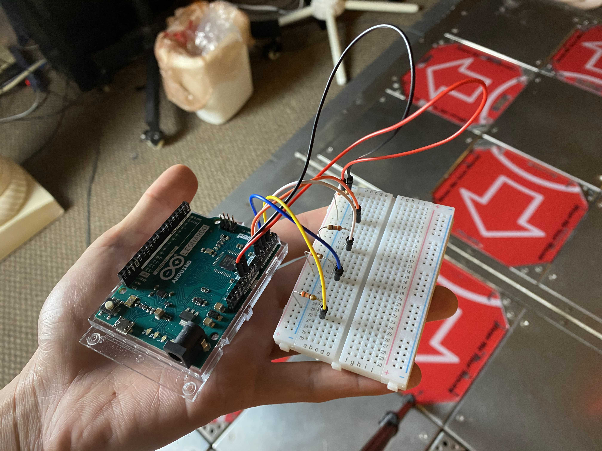

There were options for where the controller was placed.
- On P1 the I/O will be in the top-right.
- On P2 the I/O will be in the top-left.

For both of those options, if your pad's original I/O is still there then you may not be able to fit your controller there. You could remove the original pad I/O or attempt to house it under another panel. It's possible to house it under the center panel, just be aware that it will have a long cable from to connect to your PC.

For ITG dedicab pads still using the PIUIO, keeping the PIUIO will allow FSRs to support pad lights since that's actually controlled by Stepmania. This is not possible if your pad is running a BARR-IO.

  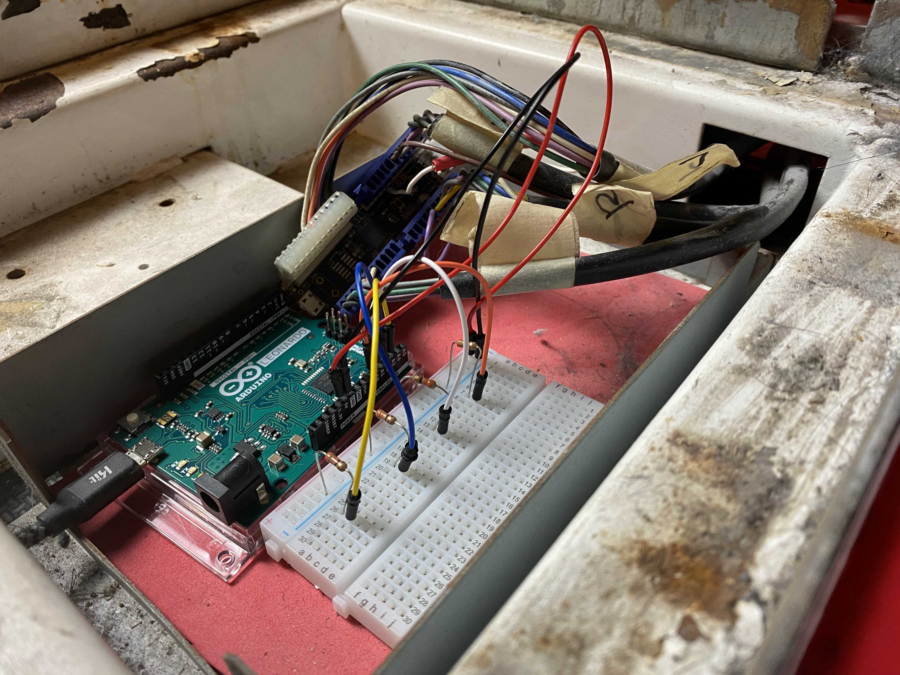
  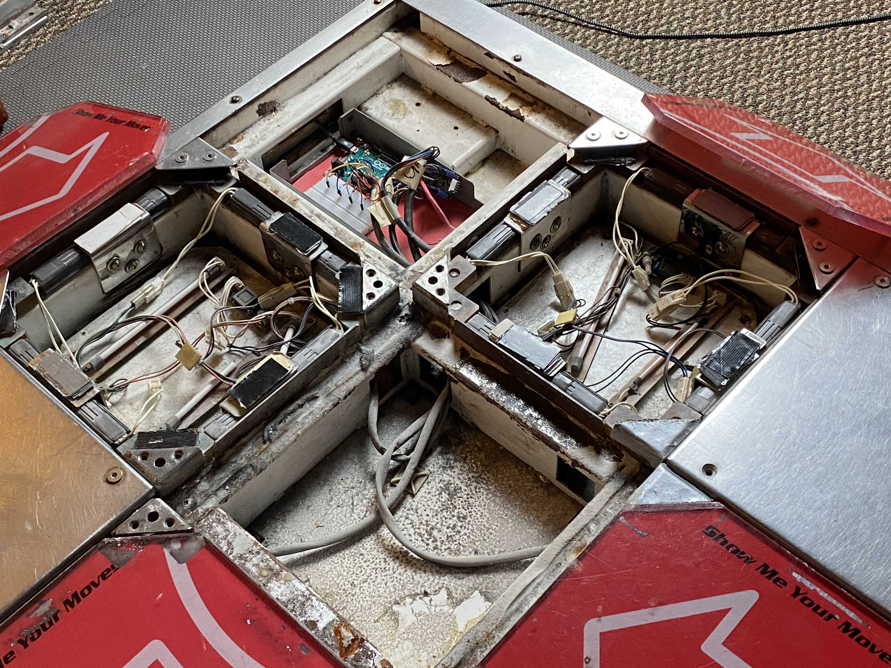

#### Setting Up the Wires
The next step was to connect the FSRs to longer wires. The wires needed to be long enough to reach from the panel that the FSR was housed in all the way to wherever the controller was placed. 

If the controller is housed under the center panel then all of the wire lengths will be equivalent lengths as all arrows are equidistant to the center. Since my controller was hosted in a corner panel, the up arrow had the shortest wire run, and my down arrow had the longest run.

I went with the approach of using *too much* wire and trimming the amount after. I did this with some wire that I spliced out of an existing cable I already wasn't using, separating out the colors, and then soldering the FSRs on one end.

  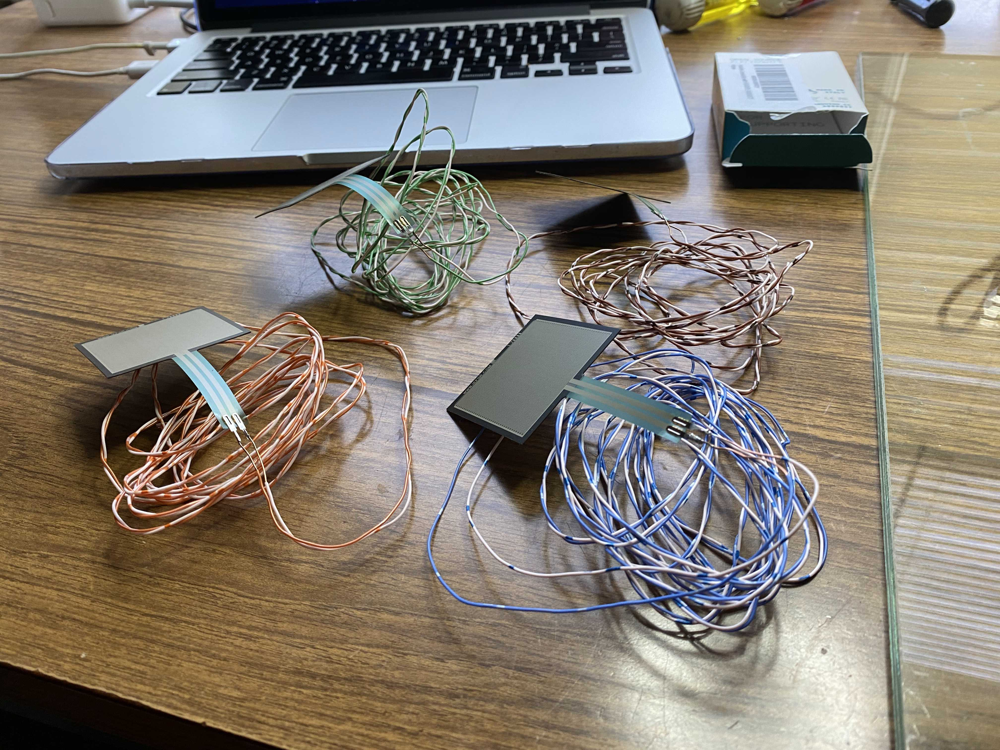
  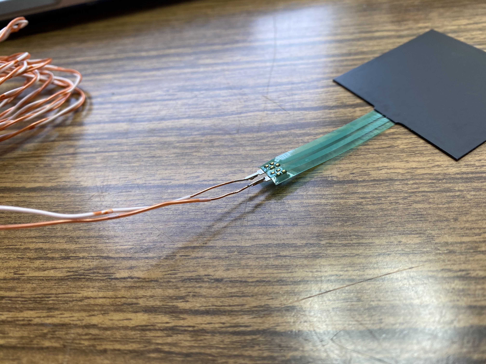  

#### FSR Placement, Running the Wires
Using some double-sided tape I stuck the FSR on top of the L-bracket and on top of the existing tape modding that I had. Since FSRs are extremely thin, placing the FSR didn't add much height to the panel at all. 
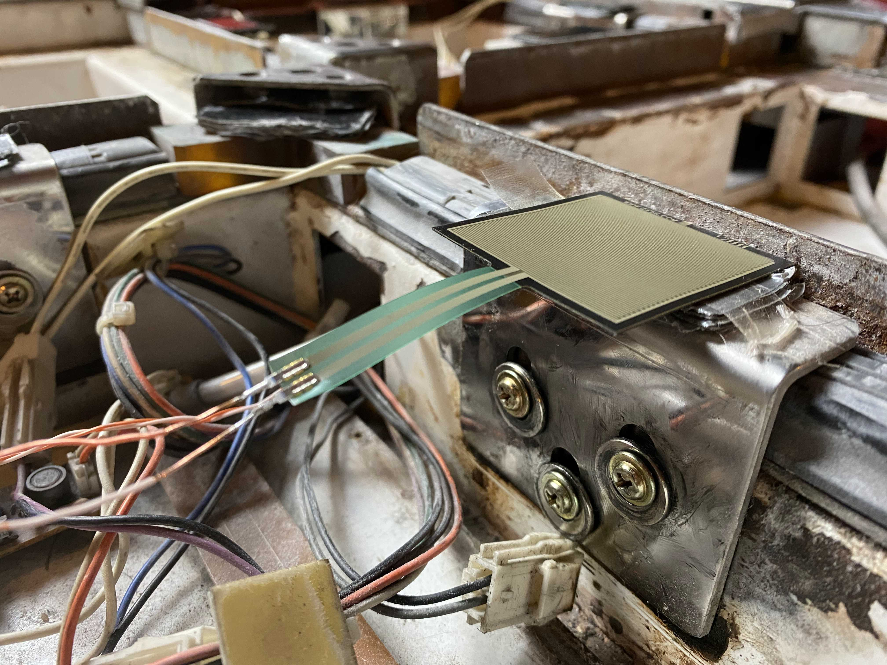

With the FSR placed, it was now possible to run the wires so that the opposite ends of the FSRs reached the controller.

  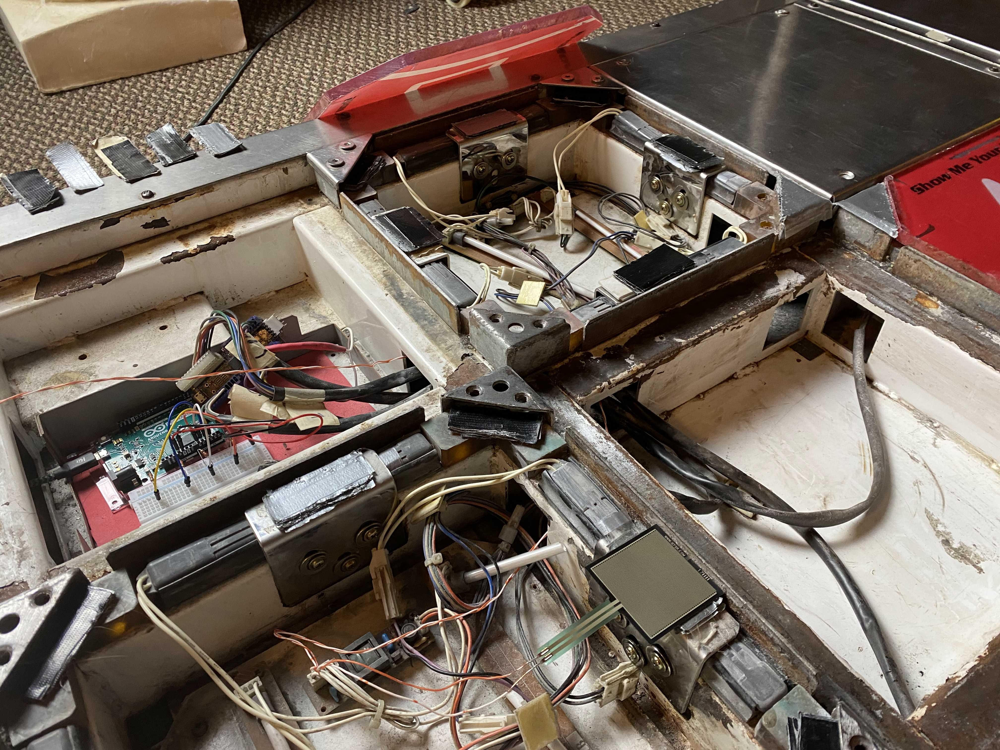 
  <i>The wire for the FSR placed on the left arrow runs through the center and up arrow wells to reach the top-left corner.</i>

  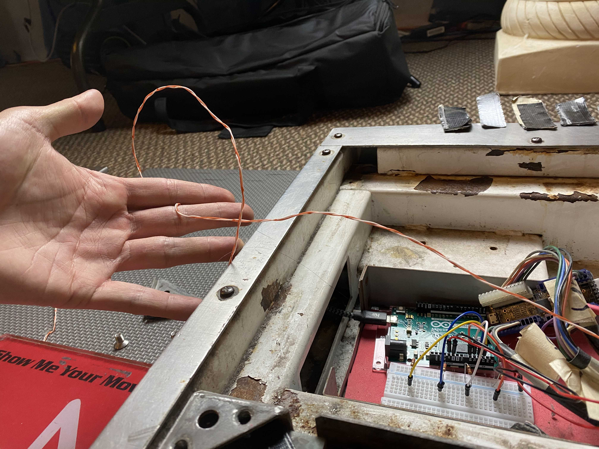 
  <i>Excess wire once I've reached the controller. Not a big deal since I cut it later on.</i>

##### Personal Notes on Pad Modding
In this context, "pad modding" refers to adding tape or foam in order to raise the height of the panels. Pad modding is subjective to the player. Getting this right will make FSR readings more accurate and more comfortable to play on.

You should focus on modding for comfort, and don't be afraid to get it wrong. There's no harm in starting off with a modding, playtesting it, and then making adjustments.

What I went for was a flat modding, meaning that the panels were flush with the center panel, no higher and no lower. 

  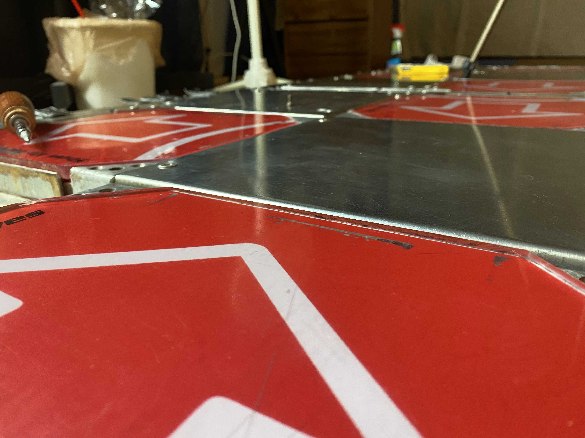 
  <i>This was a little under flush, but I fixed it later.</i>

I found limiting panel movement was important to prevent panel vibrations from giving the FSR false readings. 
- Typically people mod with foam strips but I found the foam compressing and decompressing was not accurate to play on. I modded with *only* Gorilla tape as it had minimal to no compression when pressed.
- I had the most success when the panel was *completely* balanced. A panel to me is balanced when, after removing all corner brackets, I can tap on all 4 corners as well as the center of all 4 edges without the opposite end popping up. Doing so required me to put modding on the L-brackets AND the corners.

  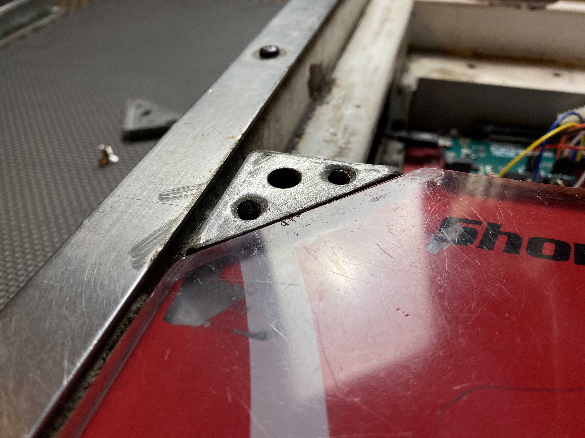

#### Plugging in the FSRs
I trimmed any excess wire, stripped the ends of the wires, and plugged the FSRs back into the breadboard just like how it was setup in the [Prototyping](#prototyping) step. I used the following pin order.
- **A0**: Left
- **A1**: Down
- **A2**: Up
- **A3**: Right

  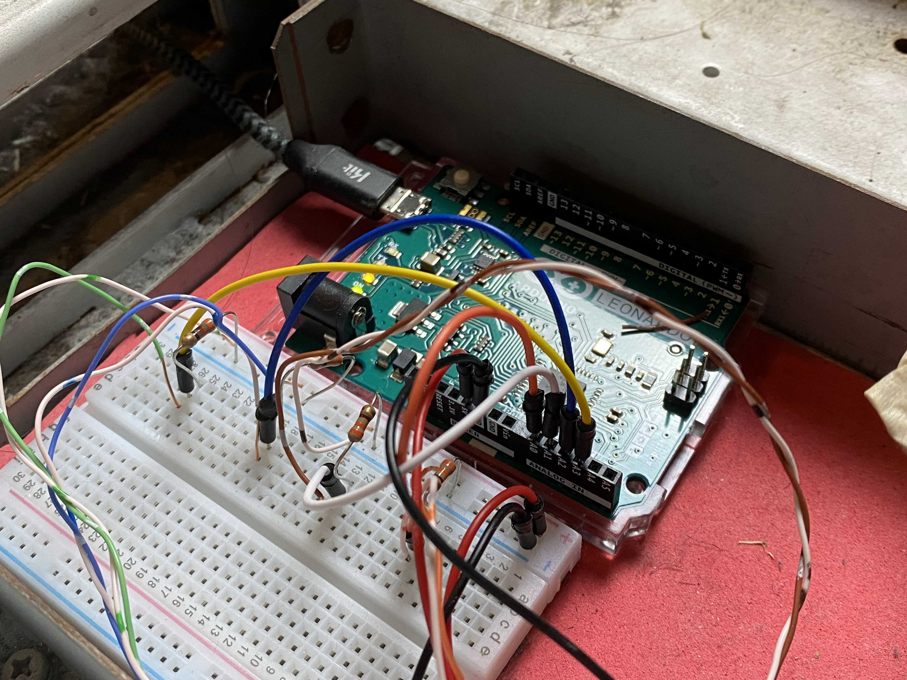

If you didn't plug the sensors to the Arudino in this order, you can either swap the order of the analog pins until it's correct (this is where colored wires help a lot), or make adjustments to the FSR code to match the order that you plugged in the FSRs. 

Plugging the sensors into the Arudino in that order is is only important if you intend on using the web app that I wrote to adjust sensitivities; the app is not necessary at all to do that.

### Flashing the Arudino
Next I installed [ArduinoJoystickLibrary](https://github.com/MHeironimus/ArduinoJoystickLibrary#installation-instructions), loaded up the Arudino IDE and uploaded the [fsr.ino](https://github.com/vlnguyen/itg-fsr/blob/master/fsr/fsr.ino) code to my Arduino.

In Stepmania, in the `Configure Keyboard/Pad Mappings` options, I can bind the panel inputs to respective arrows. If Stepmania picks up the mappings then everything's good to go! If not something either went wrong with the circuit or with uploading the code.

## API - How to Change Sensitivities
### How to Send Commands
On the Arduino IDE, open up `Tools` and select the `Serial Monitor`. A text input should appear that let's you send commands directly to the controller's serial stream.

### Commands List
#### Get Current Pressures
Type `pressures`. The serial monitor will send back a comma-separated list of how much pressure is currently being applied to each sensor. The order of the values corresponds to the order of the pins, A0, A1, A2, A3.

#### Get Current Thresholds
Type `thresholds`. The serial monitor will send back a comma-separated list of the minimum amount of pressure required to send an input on each sensor. The order of the values corresponds to the order of the pins, A0, A1, A2, A3.

#### Set New Thresholds
Type a comma separated list of four integers (i.e. `200,150,100,200`). This will set new values for the minimum threshold required to send an input. The order that it expects these values is the order of the pins, A0, A1, A2, A3.
